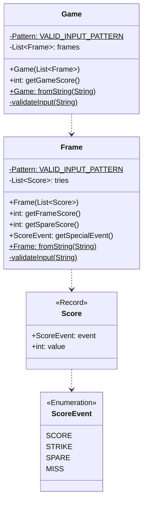

# cc-bowling-scorer

# Problem Definition
Create a program, which given a valid sequence of rolls for one line of American Ten-Pin Bowling, 
produces the total score for the game.

We can briefly summarize the scoring for this form of bowling:
- Each game, or “line” of bowling, includes ten turns, or “frames” for the bowler.
- In each frame, the bowler gets up to two tries to knock down all the pins.
- If in two tries, he fails to knock them all down, his score for that frame is the total number 
of pins knocked down in his two tries.
- If in two tries he knocks them all down, this is called a “spare” and his score for the frame is ten plus 
the number of pins knocked down on his next throw (in his next turn).
- If on his first try in the frame he knocks down all the pins, this is called a “strike”. His turn is over, 
and his score for the frame is ten plus the simple total of the pins knocked down in his next two rolls.
- If he gets a spare or strike in the last (tenth) frame, the bowler gets to throw one or two more bonus balls, 
respectively. These bonus throws are taken as part of the same turn. If the bonus throws knock down all the pins, 
the process does not repeat: the bonus throws are only used to calculate the score of the final frame.
- The game score is the total of all frame scores.

# Example Input

| Input                          | Output | Explanation                                     |
|--------------------------------|--------|-------------------------------------------------|
| X X X X X X X X X X X X        | 300    | 12 rolls, 12 strikes, 10 frames * 30 points     |
| 9- 9- 9- 9- 9- 9- 9- 9- 9- 9-  | 90     | 20 rolls, 10 pairs of 9 and a miss              | 
| 5/ 5/ 5/ 5/ 5/ 5/ 5/ 5/ 5/ 5/5 | 150    | 21 rolls, 10 pairs of 5 and spare and a final 5 |

# Problem Solution


## Logic Rules

### Spare
If a spare occurs, score is 10+next try - the first value from next frame.

### Strike
If a strike occurs, score is 10+next two frames scores, ignoring any special rules (e.g., in the case of multiple strikes.)

### Calculating the score
We need to consider if a strike or spare occurred in the current frame, then add the additional values from the future frames if they exist.

# Running the solution
- Java Version: JDK 17
- Maven Version: 3.8.6

## Build & Execute Jar

Build executable jar: 
```shell
mvn package
```
Executed by
```shell
java -jar target/cc-bowling-scorer-1.0-SNAPSHOT.jar <Score String Here>
```

Example: 
```shell
→ java -jar target/cc-bowling-scorer-1.0-SNAPSHOT.jar X X X X X X X X X X X X
Scoring a bowling game with input: X X X X X X X X X X X X
Games final score was 300
```

## Command Line via Maven
```shell
mvn compile exec:java -Dexec.args="<Score String Here>"
```

Example: 

```shell
→ mvn compile exec:java -Dexec.args="X X X X X X X X X X X X"
[INFO] Scanning for projects...
[INFO] 
[INFO] -------------------< org.example:cc-bowling-scorer >--------------------
[INFO] Building cc-bowling-scorer 1.0-SNAPSHOT
[INFO] --------------------------------[ jar ]---------------------------------
[INFO] 
[INFO] --- maven-resources-plugin:2.6:resources (default-resources) @ cc-bowling-scorer ---
[INFO] Using 'UTF-8' encoding to copy filtered resources.
[INFO] Copying 0 resource
[INFO] 
[INFO] --- maven-compiler-plugin:3.1:compile (default-compile) @ cc-bowling-scorer ---
[INFO] Changes detected - recompiling the module!
[INFO] Compiling 6 source files to /home/af/dev/coding-challenges/cc-bowling-scorer/target/classes
[INFO] 
[INFO] --- exec-maven-plugin:3.0.0:java (default-cli) @ cc-bowling-scorer ---
Scoring a bowling game with input: X X X X X X X X X X X X
Games final score was 300
[INFO] ------------------------------------------------------------------------
[INFO] BUILD SUCCESS
[INFO] ------------------------------------------------------------------------
[INFO] Total time:  0.783 s
[INFO] Finished at: 2022-11-23T19:04:55+11:00
[INFO] ------------------------------------------------------------------------
```